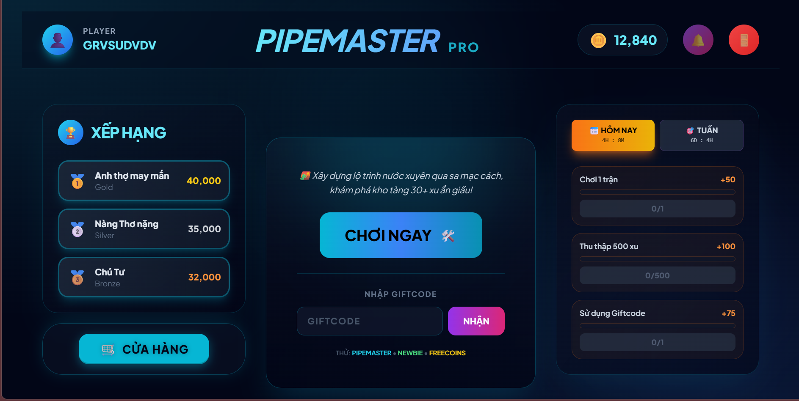
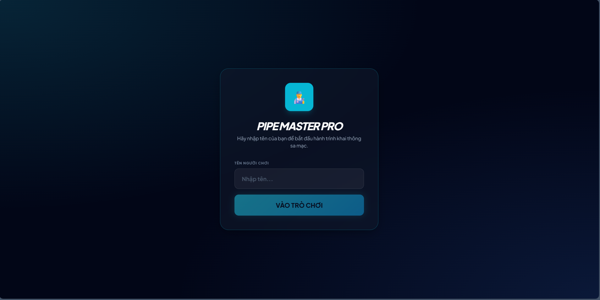
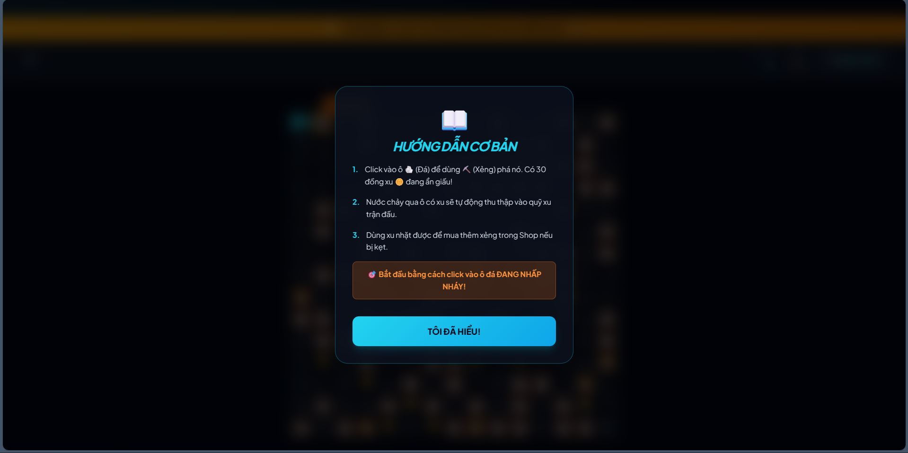

# 🧩 PipeMaster – AI Puzzle Game



**PipeMaster** is a browser-based pipe connection puzzle game developed as an **Artificial Intelligence course project**.

The objective is to rotate pipes, break obstacles, and create a valid continuous pipeline.  
The system uses **graph connectivity validation inspired by BFS/DFS algorithms** to determine whether the pipeline is complete.

---

## 🎓 Academic Purpose

This project was developed for an **Artificial Intelligence course**, demonstrating:

- Graph representation using a 2D grid
- Connectivity checking using traversal logic (BFS / DFS concepts)
- State management
- Rule-based interaction
- Algorithm-driven validation

---

## 🎮 Gameplay Preview

### Login Screen


### Tutorial Guide


### Gameplay Guide Animation


---

## ✨ Features

- 🧠 Logical pipe connection puzzle  
- 🤖 AI-inspired connectivity validation  
- 💾 Save / Load system (localStorage)  
- 👤 Player login system  
- 🪨 Breakable rock obstacles  
- 💰 Coin collection  
- ⏱️ Timer challenge  
- 🎓 Interactive tutorial  
- 🔊 Full sound effects and music  

---

## 🧠 Algorithm Concept

The pipeline is modeled as a **graph**:

- Each pipe = node  
- Each valid connection = edge  

The system verifies completion using **graph traversal logic similar to BFS or DFS**, ensuring the pipeline is logically connected.

---

## 📂 Project Structure
```
PipeMaster/
│
├── index.html
├── style.css
├── README.md
│
├── assets/
│ ├── huongdan.gif
│ ├── huongdanGame.png
│ ├── login.png
│ └── menu.png
│
└── audio/
├── background.mp3
├── gameplay.mp3
├── click.mp3
├── break.mp3
├── complete.mp3
├── error.mp3
├── hint.mp3
├── win.mp3
└── xoayong.mp3
```

---

## 🚀 How to Run

Open:``` index.html ```

or use **Live Server in VS Code**.

---

## 🛠️ Technologies Used

- HTML5  
- CSS3  
- JavaScript (ES6)  
- React (CDN)  
- localStorage API  

---

## 👤 Author

**tranvonghoclaptrinh**  
Artificial Intelligence Course Project

---

## 📜 License

Educational use only.