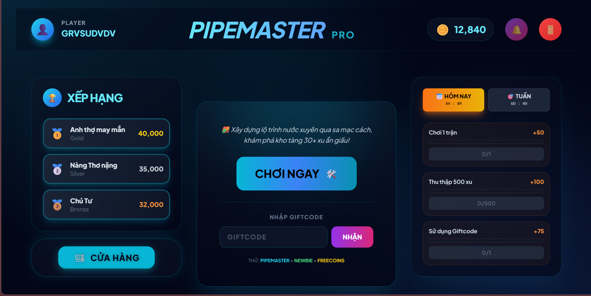
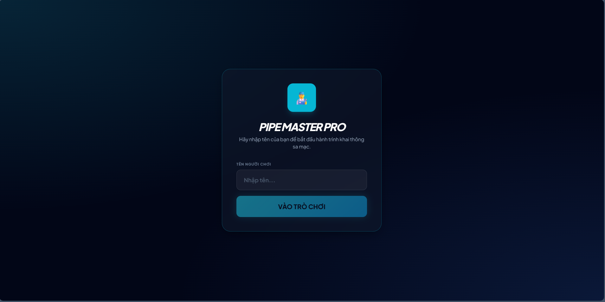
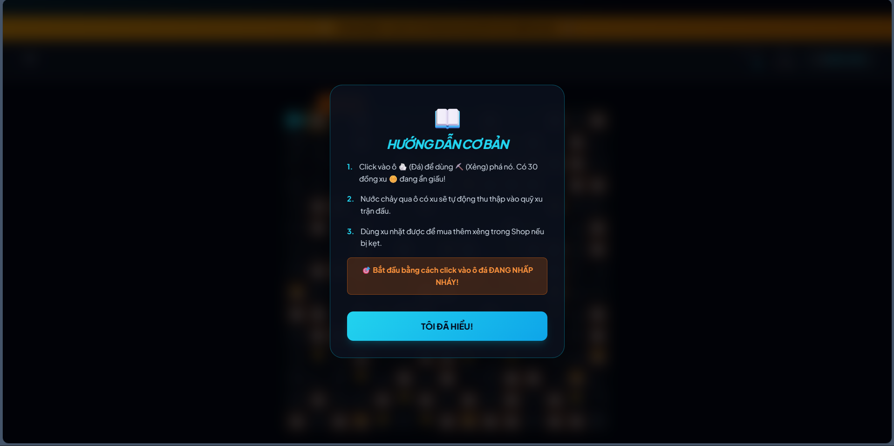

# 🧩 PipeMaster – AI Puzzle Game



**PipeMaster** là một trò chơi giải đố kết nối đường ống trên trình duyệt, được phát triển như một **dự án môn học Trí tuệ nhân tạo (AI)**. 

Mục tiêu của trò chơi là xoay các đoạn ống và phá hủy chướng ngại vật để tạo thành một hệ thống dẫn dòng hoàn chỉnh. Hệ thống sử dụng thuật toán **kiểm tra tính kết nối đồ thị (Graph Connectivity)** dựa trên các khái niệm duyệt **BFS/DFS** để xác định pipeline đã hoàn thành hay chưa.

---

## 🎓 Mục tiêu học thuật (Academic Purpose)

Dự án này minh họa các khái niệm cốt lõi trong AI và Khoa học máy tính:
- **Biểu diễn đồ thị:** Sử dụng lưới 2D (Grid) làm cấu trúc dữ liệu chính.
- **Thuật toán tìm kiếm:** Kiểm tra tính kết nối bằng logic duyệt đồ thị (BFS/DFS).
- **Quản lý trạng thái:** Theo dõi trạng thái xoay và loại ống của từng ô lưới.
- **Hệ thống luật:** Xác định tính hợp lệ của dòng chảy dựa trên các quy tắc khớp nối.

---

## ✨ Tính năng nổi bật

- 🧠 **Giải đố Logic:** Hệ thống ống nước đa dạng với độ khó tăng dần.
- 🤖 **Xác thực AI:** Thuật toán kiểm tra dòng chảy tự động và chính xác.
- 👤 **Hệ thống Người chơi:** Quản lý dữ liệu dựa trên tên người chơi (`playerName`).
- 🛒 **Cơ chế Cửa hàng:** Sử dụng xu tích lũy để mua **Xẻng (Shovel)** phá bỏ chướng ngại vật đá.
- 🎨 **Skin Dòng Chảy:** Tùy chỉnh diện mạo dòng chảy với các hiệu ứng hình ảnh độc đáo (Flow Skins).
- 💾 **Lưu trữ dữ liệu:** Tự động lưu tiến trình, xu và trang bị qua `localStorage`.
- 🔊 **Âm thanh sống động:** Hệ thống âm thanh SFX và nhạc nền đầy đủ cho từng hành động.

---

## 🎮 Ảnh minh họa

### Màn hình Đăng nhập


### Hướng dẫn chơi & Hệ thống Skin


### Hiệu ứng dòng chảy thực tế


---

## 🧠 Thuật toán lõi (Algorithm Concept)

Hệ thống đường ống được mô hình hóa như một **Đồ thị (Graph)**:
- **Nút (Node):** Mỗi đoạn ống trên lưới 2D.
- **Cạnh (Edge):** Sự khớp nối hợp lệ giữa các đầu ống liền kề.

Hệ thống xác minh việc hoàn thành bằng cách duyệt từ điểm nguồn (Source) đến điểm đích (Sink). Nếu tồn tại đường đi liên tục, trạng thái chiến thắng sẽ được kích hoạt.

---

## 📂 Cấu trúc dự án
```
PipeMaster/
├── index.html        # Giao diện và nạp CDN React
├── style.css         # Định dạng giao diện & hiệu ứng Skin
├── script.js         # Logic game, thuật toán AI & quản lý State
├── README.md         # Tài liệu hướng dẫn
├── assets/           # Hình ảnh và gif hướng dẫn
└── audio/            # Hệ thống âm thanh (click, break, win,...)
```
---

## 🛠️ Công nghệ sử dụng

- **Ngôn ngữ:** JavaScript (ES6+), HTML5, CSS3.
- **Thư viện:** React (vận hành qua CDN).
- **Lưu trữ:** Web Storage API (localStorage).

---

## 👤 Thông tin tác giả (Author)

**tranvonghoclaptrinh** *Dự án môn học Trí tuệ nhân tạo*

[](https://github.com/tranvonghoclaptrinh)
[](mailto:tranhuuvong23092006@gmail.com)

---

## 📜 Giấy phép
Sử dụng cho mục đích giáo dục và học tập.